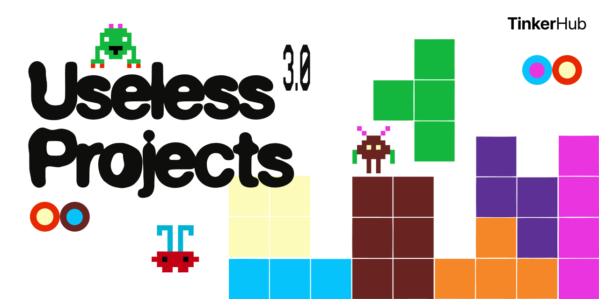

# [Project Name] : Aunty-Virus

## Basic Details
### Team Name: 404 Brain not found

### Team Members
- Team Lead:Aditya U Pillai
- Member 2: Rania Shaji

---

## Project Description
Aunty-Virus 🦠💚 is a satirical cybersecurity-style web app that scans your achievements for “Relative Pride” and responds with passive-aggressive Malayalam/Manglish aunty judgments. Hear the roast, summon another aunty, mutate it, or infect the Family WhatsApp Group. Because aunty is the real cyber threat. 💀

---

## The Problem (that doesn't exist)
Young adults, students, and overachievers are constantly at risk of feeling unpunished joy after securing a job, getting high grades, or buying a new phone. Society suffers from a critical shortage of unsolicited comparison-based guilt, leading to dangerous levels of self-satisfaction. Without intervention, people might accidentally feel good about their milestones without wondering what *Suresh-inte mon* achieved today.

---

## The Solution (that nobody asked for)
**Aunty-Virus v1.0** introduces a high-tech Relative Disapproval Detection System. Built into a retro green-and-black cyber terminal, it actively scans your milestone input, calculates an arbitrary **Relative Pride Threat Level (80%–99%)**, and dispatches targeted Manglish roasts backed by automated Malayalam Text-to-Speech voice synthesis. If one opinion isn't enough, users can escalate the roast intensity through the Mutation Engine or spread the payload directly to the Family WhatsApp Network.

---

## Technical Details

### Technologies/Components Used

#### For Software:
- **Languages used:** HTML5, CSS3, JavaScript (ES6+)
- **Frameworks used:** None (Pure Vanilla Web Architecture)
- **Libraries used:** FontAwesome / Iconify (for mascot vectors)
- **Tools used:** VS Code, Git, GitHub, Web Speech API, Google Translate TTS API


---

### Implementation

#### For Software:

##### Installation
```bash
# Clone the repository
git clone [https://github.com/your-username/Aunty-Virus.git](https://github.com/your-username/Aunty-Virus.git)

# Navigate to the project directory
cd Aunty-Virus

# Option 1: Open directly in default web browser
open index.html

# Option 2: Run using VS Code Live Server extension
# Click 'Go Live' from the VS Code status bar

Screenshots
.jpeg>)

.jpeg>)
.jpeg>)
.jpeg>)
images/WhatsApp Image 2026-09-12 at 10.29.12 AM.jpeg
